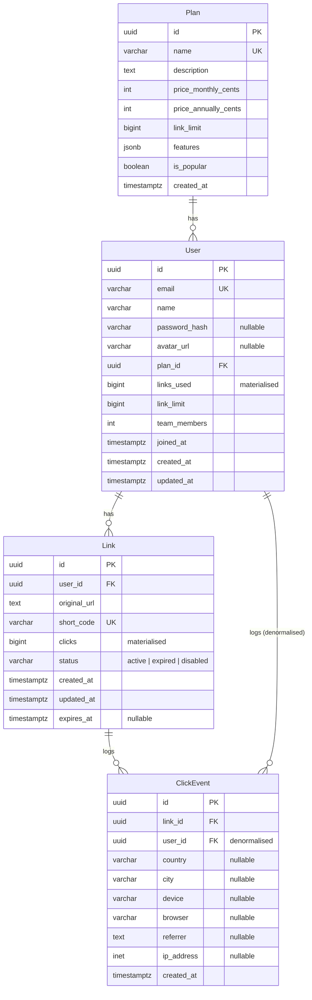

# TinyURL — Production Database Schema

## 1. Entities

### 1.1 User

Represents a registered person or team account. Merges what the frontend calls `Account` and `AuthSession` into one row.

**Fields**

| Field | Type | Nullable | Default | Notes |
|---|---|---|---|---|
| `id` | `UUID` | No | `gen_random_uuid()` | Primary key |
| `email` | `VARCHAR(255)` | No | — | Unique. Used for sign-in. |
| `name` | `VARCHAR(255)` | No | — | Display name. Derived from email on sign-up but editable. |
| `password_hash` | `VARCHAR(255)` | Yes (OAuth) | — | `NULL` for OAuth-only users. |
| `avatar_url` | `VARCHAR(512)` | Yes | `NULL` | — |
| `plan_id` | `UUID` | No | (FK → Plan) | Current subscription tier. |
| `links_used` | `BIGINT` | No | `0` | Materialised counter. Updated on link create / delete. See computed note below. |
| `link_limit` | `BIGINT` | No | `1000` | Determined by plan; stored here for fast reads. |
| `team_members` | `INT` | No | `1` | Number of seats under the account. |
| `joined_at` | `TIMESTAMPTZ` | No | `now()` | Maps to `accountInfo.joined`. |
| `created_at` | `TIMESTAMPTZ` | No | `now()` | — |
| `updated_at` | `TIMESTAMPTZ` | No | `now()` | — |

**Indexes**
- `UNIQUE` on `(email)`
- `BTREE` on `(plan_id)`

**Foreign Keys**
- `plan_id` → `Plan.id`

**Relationships**
- Belongs to one Plan.
- Has many Links.
- Has many ClickEvents (through Links; direct FK on ClickEvent).

**Computed fields (DO NOT store — derive at query time)**
- None strictly. `links_used` is a materialised counter; its canonical source is `COUNT(*)` of the user's Links. A periodic or trigger-based reconciliation job is acceptable.

---

### 1.2 Plan

A subscription tier. Seeded at deploy time; not user-writable.

**Fields**

| Field | Type | Nullable | Default | Notes |
|---|---|---|---|---|
| `id` | `UUID` | No | `gen_random_uuid()` | Primary key |
| `name` | `VARCHAR(50)` | No | — | One of `Free`, `Pro`, `Business` |
| `description` | `TEXT` | No | — | — |
| `price_monthly_cents` | `INT` | No | — | Price in USD cents (e.g. 2900 for $29) |
| `price_annually_cents` | `INT` | No | — | Price in USD cents (e.g. 2400 for $24) |
| `link_limit` | `BIGINT` | No | — | Max links per billing period |
| `features` | `JSONB` | No | `'[]'` | Array of feature strings |
| `is_popular` | `BOOLEAN` | No | `false` | Highlight "Most Popular" badge |
| `created_at` | `TIMESTAMPTZ` | No | `now()` | — |

**Indexes**
- `UNIQUE` on `(name)`

**Relationships**
- Has many Users.

---

### 1.3 Link

A shortened URL. Core entity of the application.

**Fields**

| Field | Type | Nullable | Default | Notes |
|---|---|---|---|---|
| `id` | `UUID` | No | `gen_random_uuid()` | Primary key |
| `user_id` | `UUID` | No | — | FK → User |
| `original_url` | `TEXT` | No | — | The long URL being redirected to. |
| `short_code` | `VARCHAR(20)` | No | — | Unique slug (e.g. `abc123`). Does NOT include the domain. |
| `clicks` | `BIGINT` | No | `0` | Materialised counter. Incremented atomically on each redirect. See computed note. |
| `status` | `VARCHAR(20)` | No | `'active'` | One of `active`, `expired`, `disabled`. |
| `created_at` | `TIMESTAMPTZ` | No | `now()` | — |
| `updated_at` | `TIMESTAMPTZ` | No | `now()` | — |
| `expires_at` | `TIMESTAMPTZ` | Yes | `NULL` | When set and passed, status transitions to `expired`. |

**Indexes**
- `UNIQUE` on `(short_code)`
- `BTREE` on `(user_id)` — fast lookups of a user's links
- `BTREE` on `(user_id, clicks DESC)` — top-performing links ranking
- `BTREE` on `(user_id, created_at DESC)` — recent links listing
- `BTREE` on `(status)` — filtering active vs expired vs disabled
- `BTREE` on `(expires_at)` — cron job that marks links expired

**Foreign Keys**
- `user_id` → `User.id`

**Relationships**
- Belongs to one User.
- Has many ClickEvents.

**Computed fields (DO NOT store — derive at query time)**
- `shortUrl` (full URL = `domain + "/" + short_code`) — computed in the API layer, not stored.
- `clicks` is a materialised counter; its canonical source is `COUNT(*)` from `ClickEvent`. If read volume is low, drop the counter and use a live COUNT instead.

---

### 1.4 ClickEvent

An individual redirect event. One row per click. This is the only event-level storage; everything else (`Visit`, `RecentVisitor`, `CtrStats`) is derived from this table.

**Fields**

| Field | Type | Nullable | Default | Notes |
|---|---|---|---|---|
| `id` | `UUID` | No | `gen_random_uuid()` | Primary key |
| `link_id` | `UUID` | No | — | FK → Link |
| `user_id` | `UUID` | No | — | FK → User (denormalised for fast queries) |
| `country` | `VARCHAR(2)` | Yes | `NULL` | ISO 3166-1 alpha-2 |
| `city` | `VARCHAR(255)` | Yes | `NULL` | — |
| `device` | `VARCHAR(50)` | Yes | `NULL` | `Desktop`, `Mobile`, `Tablet` |
| `browser` | `VARCHAR(50)` | Yes | `NULL` | `Chrome`, `Safari`, `Firefox`, `Edge`, etc. |
| `referrer` | `TEXT` | Yes | `NULL` | HTTP Referer header |
| `ip_address` | `INET` | Yes | `NULL` | For geo-IP lookup; may be anonymised. |
| `created_at` | `TIMESTAMPTZ` | No | `now()` | Timestamp of the redirect. |

**Indexes**
- `BTREE` on `(link_id)` — all clicks for a given link
- `BTREE` on `(user_id, created_at DESC)` — recent visitors feed
- `BTREE` on `(user_id, created_at)` — time-series aggregation (Visits Over Time)
- `BRIN` on `(created_at)` — efficient range scans for large time-series
- `BTREE` on `(user_id, link_id, created_at)` — composite for top-links ranking in a date range

**Foreign Keys**
- `link_id` → `Link.id`
- `user_id` → `User.id`

**Relationships**
- Belongs to one Link.
- Belongs to one User (denormalised).

**Computed fields (DO NOT store)**
- `time` (human-readable "2 min ago") — computed client-side or in the API from `created_at`.
- All aggregated Visit records, TopLink records, CtrStats — derived at query time by aggregate queries over ClickEvent.

---

## 2. Entity Relationship Diagram (Mermaid)



---

## 3. Prisma Schema Proposal

```prisma
enum LinkStatus {
  active
  expired
  disabled
}

model Plan {
  id                  String   @id @default(uuid()) @db.Uuid
  name                String   @unique @db.VarChar(50)
  description         String   @db.Text
  priceMonthlyCents   Int
  priceAnnuallyCents  Int
  linkLimit           BigInt
  features            Json     @default("[]")
  isPopular           Boolean  @default(false)
  createdAt           DateTime @default(now()) @map("created_at")

  users               User[]

  @@map("plans")
}

model User {
  id              String   @id @default(uuid()) @db.Uuid
  email           String   @unique @db.VarChar(255)
  name            String   @db.VarChar(255)
  passwordHash    String?  @map("password_hash") @db.VarChar(255)
  avatarUrl       String?  @map("avatar_url") @db.VarChar(512)
  planId          String   @map("plan_id") @db.Uuid
  linksUsed       BigInt   @default(0) @map("links_used")
  linkLimit       BigInt   @default(1000) @map("link_limit")
  teamMembers     Int      @default(1) @map("team_members")
  joinedAt        DateTime @default(now()) @map("joined_at")
  createdAt       DateTime @default(now()) @map("created_at")
  updatedAt       DateTime @updatedAt @map("updated_at")

  plan            Plan     @relation(fields: [planId], references: [id])
  links           Link[]
  clickEvents     ClickEvent[]

  @@index([planId])
  @@map("users")
}

model Link {
  id          String     @id @default(uuid()) @db.Uuid
  userId      String     @map("user_id") @db.Uuid
  originalUrl String     @map("original_url") @db.Text
  shortCode   String     @unique @map("short_code") @db.VarChar(20)
  clicks      BigInt     @default(0)
  status      LinkStatus @default(active)
  createdAt   DateTime   @default(now()) @map("created_at")
  updatedAt   DateTime   @updatedAt @map("updated_at")
  expiresAt   DateTime?  @map("expires_at")

  user        User        @relation(fields: [userId], references: [id])
  clickEvents ClickEvent[]

  @@index([userId])
  @@index([userId, clicks(sort: Desc)])
  @@index([userId, createdAt(sort: Desc)])
  @@index([status])
  @@index([expiresAt])
  @@map("links")
}

model ClickEvent {
  id        String   @id @default(uuid()) @db.Uuid
  linkId    String   @map("link_id") @db.Uuid
  userId    String   @map("user_id") @db.Uuid
  country   String?  @db.VarChar(2)
  city      String?  @db.VarChar(255)
  device    String?  @db.VarChar(50)
  browser   String?  @db.VarChar(50)
  referrer  String?  @db.Text
  ipAddress String?  @map("ip_address") @db.Inet
  createdAt DateTime @default(now()) @map("created_at")

  link      Link     @relation(fields: [linkId], references: [id])
  user      User     @relation(fields: [userId], references: [id])

  @@index([linkId])
  @@index([userId, createdAt(sort: Desc)])
  @@index([userId, createdAt])
  @@index([createdAt])
  @@map("click_events")
}
```

---

## 4. REST API Resource List

| Method | Path | Description | Returns |
|---|---|---|---|
| `POST` | `/api/auth/signup` | Register a new user | `AuthResponse` |
| `POST` | `/api/auth/signin` | Sign in (email + password or OAuth) | `AuthResponse` |
| `POST` | `/api/auth/signout` | Invalidate session | — |
| `GET` | `/api/auth/session` | Get current session | `AuthResponse` |
| `GET` | `/api/user/me` | Get current user profile | `UserResponse` |
| `PATCH` | `/api/user/me` | Update profile | `UserResponse` |
| `GET` | `/api/plans` | List subscription plans | `PlanResponse[]` |
| `POST` | `/api/links` | Create a shortened link | `LinkResponse` |
| `GET` | `/api/links` | List user's links (paginated, sortable, searchable) | `LinkResponse[]` |
| `GET` | `/api/links/:id` | Get single link | `LinkResponse` |
| `PATCH` | `/api/links/:id` | Update link (status, originalUrl, expiresAt) | `LinkResponse` |
| `DELETE` | `/api/links/:id` | Delete a link | — |
| `GET` | `/api/links/top` | Top-performing links (query: `?limit=5`) | `TopLinkResponse[]` |
| `GET` | `/api/analytics/visits` | Visits over time (query: `?period=7d`) | `VisitResponse[]` |
| `GET` | `/api/analytics/ctr` | CTR statistics | `CtrStatsResponse` |
| `GET` | `/api/analytics/recent-visitors` | Recent visitors (query: `?limit=10`) | `RecentVisitorResponse[]` |
| `GET` | `/api/links/:id/clicks` | Click events for a specific link (paginated) | `ClickEventResponse[]` |
| `GET` | `/r/:shortCode` | Redirect to original URL (logs a ClickEvent) | HTTP 302 redirect |

---

## 5. Frontend DTOs (API Response Shapes)

### AuthResponse

```json
{
  "user": {
    "id": "uuid",
    "email": "string",
    "name": "string",
    "avatarUrl": "string | null",
    "plan": "Free | Pro | Business",
    "joinedAt": "ISO date string",
    "teamMembers": "integer",
    "linksUsed": "integer",
    "linkLimit": "integer"
  },
  "token": "string (JWT)"
}
```

### UserResponse

```json
{
  "id": "uuid",
  "email": "string",
  "name": "string",
  "avatarUrl": "string | null",
  "plan": "Free | Pro | Business",
  "joinedAt": "ISO date string",
  "teamMembers": "integer",
  "linksUsed": "integer",
  "linkLimit": "integer"
}
```

### PlanResponse

```json
{
  "id": "uuid",
  "name": "Free | Pro | Business",
  "description": "string",
  "priceMonthly": 0,
  "priceAnnually": 0,
  "linkLimit": "integer",
  "features": ["string"],
  "isPopular": "boolean"
}
```

### LinkResponse

```json
{
  "id": "uuid",
  "originalUrl": "string",
  "shortUrl": "string (full URL including domain)",
  "shortCode": "string",
  "clicks": "integer",
  "status": "active | expired | disabled",
  "createdAt": "ISO date string",
  "expiresAt": "ISO date string | null"
}
```

### TopLinkResponse (computed — derived from Link + ClickEvent)

```json
{
  "id": "uuid",
  "url": "string (host + path, no protocol)",
  "shortUrl": "string",
  "clicks": "integer",
  "rank": "integer"
}
```

### VisitResponse (computed — aggregated from ClickEvent)

```json
{
  "date": "string (e.g. 'Jul 7')",
  "visits": "integer"
}
```

### CtrStatsResponse (computed — aggregated from ClickEvent)

```json
{
  "average": 4.8,
  "best": 12.3,
  "change": "+0.6"
}
```

### RecentVisitorResponse (computed — queried from ClickEvent with JOIN to Link)

```json
{
  "country": "string",
  "city": "string",
  "device": "string",
  "browser": "string",
  "time": "string (relative, e.g. '2 min ago')",
  "timestamp": "ISO date string (for client-side relative time calc)"
}
```

### ClickEventResponse

```json
{
  "id": "uuid",
  "linkId": "uuid",
  "country": "string | null",
  "city": "string | null",
  "device": "string | null",
  "browser": "string | null",
  "referrer": "string | null",
  "createdAt": "ISO date string"
}
```

---

## 6. Summary: UI Projections vs. DB Entities

| Frontend Mock Type | DB Entity | How It Should Be Served |
|---|---|---|
| `Link` | `Link` | Direct DB row + computed `shortUrl` in API layer |
| `Visit` | — | Aggregate query over `ClickEvent` grouped by date |
| `TopLink` | — | Query over `Link` sorted by `clicks DESC`, limited by `?limit=` |
| `RecentVisitor` | — | Query over `ClickEvent` ordered by `created_at DESC`, limited by `?limit=` |
| `CtrStats` | — | Aggregate math over `ClickEvent` |
| `accountInfo` | `User` | `User` row + computed `linksUsed` counter |
| `AuthSession` | `User` | JWT-encoded user subset |
| `Plan` | `Plan` | Seeded `Plan` row |